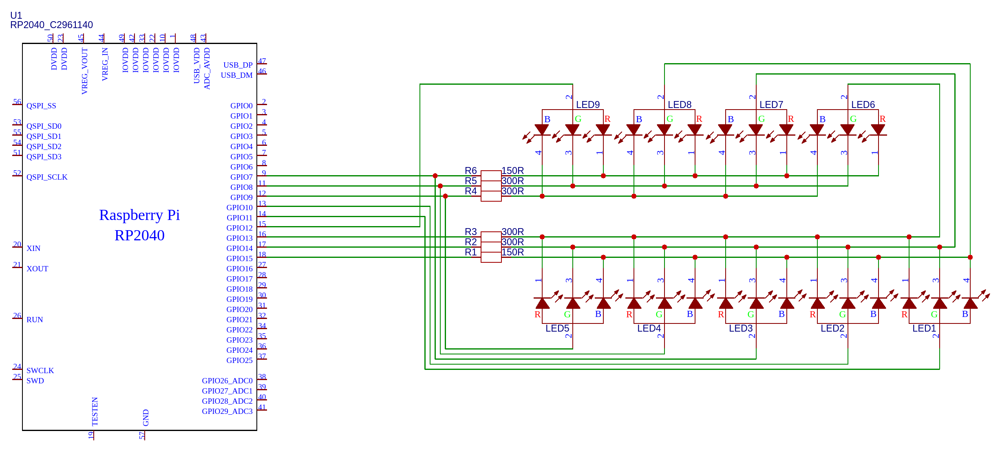

# RGB LED cross connection

This is just a PoC implementation of an idea to connect LEDs using the minimal possible amount of pins on the MCU.
Given the LEDs are of a common anode type, it's possible to use RP2040's PIO to emulate tri-state PWM (switching between HiZ and GND instead of VCC and GND).

